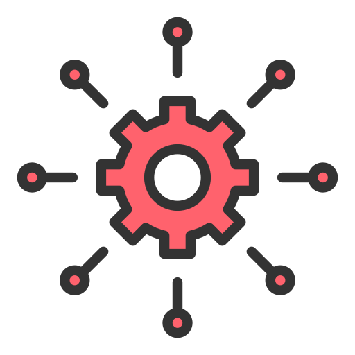

### Hi there 👋

    <h1>
        
    </h1>
    <h2 style="font-size: 36px;">🚀 About Me</h2>
    
I am an Electrical Engineering Doctorate Student, specializing in Robotics and Controls Engineering. 

   <h2 style="display: flex; justify-content: center; align-items:center;" class="section-heading">
       
         Programming Languages
   </h2>
   
 As a multifaceted engineer, I've developed proficiency in a diverse set of programming languages, each serving as a pivotal tool in my development arsenal. Here are the languages I wield to turn complex problems into elegant solutions

  
  
   
  
  
  

   <h2 style="display: flex; justify-content: center; align-items: center;" class="section-heading">
       
    Cloud Technologies
   </h2>
   
In the dynamic realm of cloud computing, I am proficient in leveraging leading cloud platforms and technologies to architect, deploy, and manage scalable, highly available, and fault-tolerant systems. Here's a glance at the cloud technologies I specialize in:

  
  
  

   <h2 style="display: flex; justify-content: center; align-items: center;" class="section-heading">
      
         Frameworks
   </h2>
   
Frameworks are the backbone of my development process, providing the structure and tools necessary for building scalable, efficient applications. My expertise spans a broad spectrum of frameworks, each chosen for its ability to facilitate rapid development and deliver robust functionality.

  
  
  
  
  
  
  
  
  

<!--Stats Section-->

   <h2 style="display: flex; justify-content: center; align-items: center;" class="section-heading">
       
         GitHub Stats
   </h2>
   
Peek into my GitHub stats to see how I juggle code. Dive in to check out the milestones of digital journey.

   

      

         
      

      

         
      
 
   

   <h2 style="display: flex; justify-content: center; align-items: center;" class="section-heading">
      Github Commits
   </h2>
    
This section highlights my daily activity, showcasing the repositories I am currently working on. Each commit represents progress or fixes to ongoing projects, reflecting my commitment to continuous improvement and collaborative development. Dive into the commit messages for insights into what I've been up to!

      
      

   <h2 style="display: flex; justify-content: center; align-items: center;" class="section-heading">
      
         Connections
   </h2>
    
Follow my LinkedIn to be part of my social network.

    

